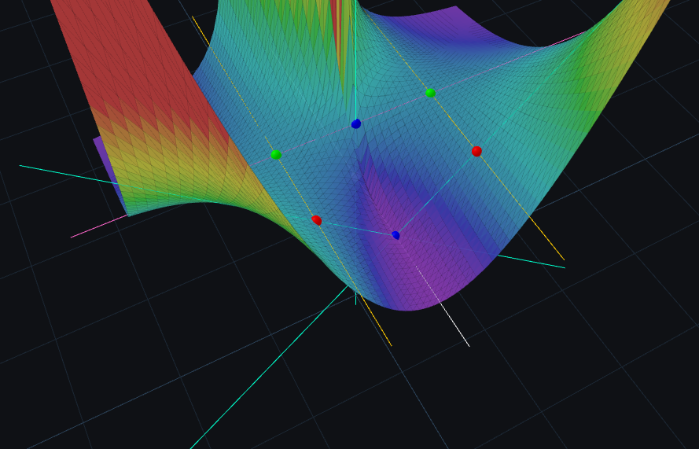
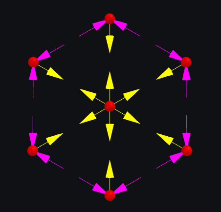
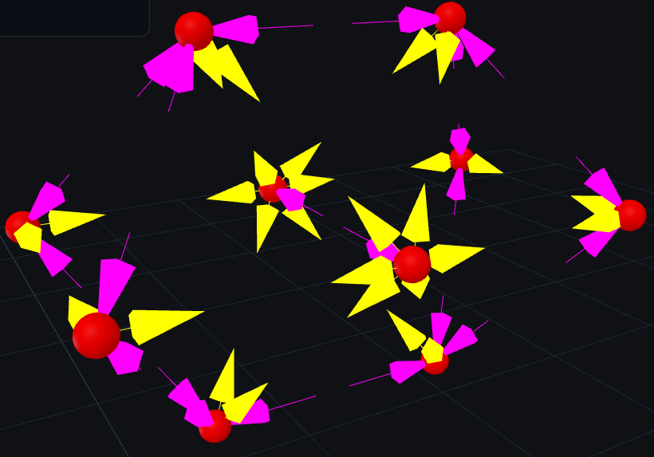

# Intro

This repo is not about demonstrating coding skills. I generated these files mainly with AI. 
I would like to share the joy of visualizing some complex concepts with this nice 3D js lib: [ThreeJS](https://threejs.org/examples).
Feedback is welcome at demiantamas[at] gmail [dot] com.

## run server:
`python3 -m http.server 8000`

## url:
`http://localhost:8000/index.html`

# Content

## Octahedron

It is the only regular polyhedron with even vertex degree. Nnumber of faces meeting at each vertex = 4.
I will show later its unique relation to identities. Now it is just the helloworld example.

## K3,3

The richest automorphism group of 2D (planar) embeddings of the (non-planar) `K3,3` graph is the hexagonal dihedral group with order of 12.
I asked the AI to generate the most symmetric 3D embedding. I got this. :) Order = 4 only. Triangular prism would have been simpler and better.
Order may reach 72 (maximal) in 4D...

## K7

K4 is like tetrahedron but you can't map K5 or K6 to a polyhedron. 
How about K7? (Császár polyhedron)

TODO check faces and winding

## K7 - Fano plane

The Fano plane is the smallest possible finite projective plane.
- Every line contains exactly 3 points. 
- Ev ery point lies on exactly 3 lines. 
- Any two distinct points determine a unique line. 
- Any two distinct lines intersect at a unique point (there are no parallel lines).

Fano plane can be embedded in a 2D torus surface (toroidal embedding) and it exhibits translational symmetry. 
When I embed the torus surface into 3D I don't bend those lines but draw circles which ruin this symmetry unfortunately. (TODO)

## Exponentiation

Exponentiation operation is trivial, right? It is just a repeated multiplication. 
`x^0=1`, `0^x=0` but how about `0^0`? Finally, you can read the value from the displayed surface. :)
Surface contains seven lines which intersect each other in 7 points. (not Fano plane)

(The surface at (x=0,y=0) is not accurate due to the poor resolution.)

Challenge: find the parabola and the natural logarithm function. 

## The simplest hyperstatic 2D and 3D systems

Simplest in this sense:
- minmal number of nodes where 
- uniform length of members,
- no double edges (members/bars/columns).

Think of these conditions as constraints (`|x_i-x_j|>=2r`) amongst uniform spheres.

Force system corresponding to the non-degenerate eigenvector (of eigenvalue = 0) is displayed with arrows.

The key property in simple terms: forces cancel each other out at each node.

Challenge: Prove that there is no hyperstatic 2D/3D structural system with fewer nodes.

## Clock design

Every football fan knows that icosahedral symmetry is the largest polyhedral symmetry group in 3D (if we ignore flat cyclic and dihedral groups).
Order=60 raises the question: why don't we build a minute counter from an icosahedron.
(We also have regular 3D polyhedra with order=24 and order=12 btw.) 
Answer: these groups are not cyclic. We can not rotate it around a single axis to visit all the group elements.
2 axes are enough, however. Finding a 'simple' Hamiltonian circle was a smaller challenge here.

TODO add labels and program

## Periodic table

How would it look like if we wouldnt flatten the quantum numbers?
- Mendeleev: `x:{l,m_l,m_s}, y:n`
- threejs allows this : `x:l, y:n, z:m_l,m_s`

TODO pull request to []this demo](https://threejs.org/examples/?q=perio#css3d_periodictable)

## Visualization of the Lie Algebra of SO(3)

SO(3) ("set" of 3D rotations) is a 3-dimensional compact manifold and a Lie group. 
It is topologically equivalent to the real projective space.
SO(3) is a space but not a vector space. Its Lie algebra (tangent space at the identity) is a vector space (additive, etc).
In this demo small Rubik's cubes indicate the corresponding orientation for each position after embedding the Lie algebra into the world space of ThreeJS.

TODO find my old implementation

