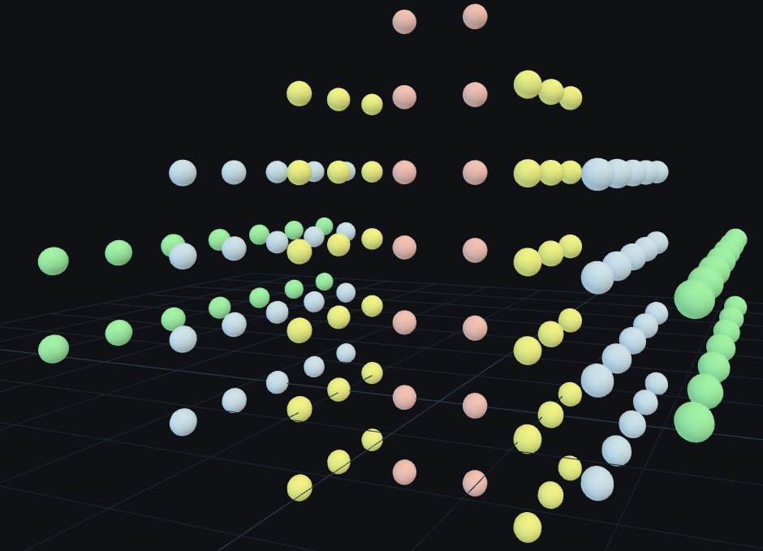
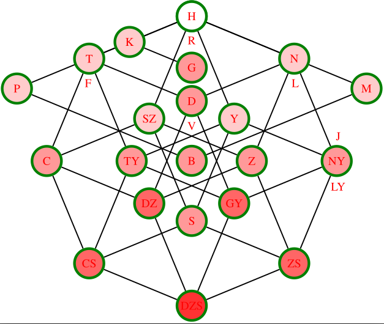

# Intro

This repo is not about demonstrating coding skills. I generated the first three files mainly with AI.
I would like to share the joy of visualizing some complex concepts with this nice 3D js lib: [ThreeJS](https://threejs.org/examples).
Feedback is welcome at demiantamas[at] gmail [dot] com.

## Deployed URL

https://tamasdemian.github.io/threejs_fun/

## Run Local Server

Get your copy, start a webserver:
``` bash
git clone git@github.com:tamasdemian/threejs_fun.git
cd threejs_fun
python3 -m http.server 8000 # or run any other webserver
```
then visit this URL:
`http://localhost:8000/index.html`

# Content

## Octahedron

It is the only regular polyhedron with even vertex degree. Nnumber of faces meeting at each vertex = 4.
I will show later its unique relation to identities. Now it is just the helloworld example.

## K7

K4 is like tetrahedron but you can't map K5 or K6 to a polyhedron. 
How about K7? (Császár polyhedron)

TODO check faces and winding

## K7 - Fano Plane

The Fano plane is the smallest possible finite projective plane.
- Every line contains exactly 3 points. 
- Ev ery point lies on exactly 3 lines. 
- Any two distinct points determine a unique line. 
- Any two distinct lines intersect at a unique point (there are no parallel lines).

Fano plane can be embedded in a 2D torus surface (toroidal embedding) and it exhibits translational symmetry. 
When I embed the torus surface into 3D I don't bend those lines but draw circles which ruin this symmetry unfortunately. (TODO)

## Exponentiation

Exponentiation operation is trivial, right? It is just a repeated multiplication. 
`x^0=1`, `0^x=0` but how about `0^0`? Finally, you can read the value from the displayed surface. :)
Surface contains seven lines which intersect each other in 7 points. (not Fano plane)


(The surface at (x=0,y=0) is not accurate due to the poor resolution.)

Challenge: find the parabola and the natural logarithm function. 

## The Simplest Hyperstatic 2D and 3D Systems

Simplest in this sense:
- minmal number of nodes where 
- uniform length of members,
- no double edges (members/bars/columns).

Think of these conditions as constraints (`|x_i-x_j|>=2r`) amongst uniform spheres.

Force system corresponding to the non-degenerate eigenvector (of eigenvalue = 0) is displayed with arrows.


The key property in simple terms: forces cancel each other out at each node.

Challenge: Prove that there is no hyperstatic 2D/3D structural system with fewer nodes.

## Clock design

Every football fan knows that icosahedral symmetry is the largest polyhedral symmetry group in 3D (if we ignore flat cyclic and dihedral groups).
Order=60 raises the question: why don't we build a minute counter from an icosahedron.
(We also have regular 3D polyhedra with order=24 and order=12 btw.) 
Answer: these groups are not cyclic. We can not rotate it around a single axis to visit all the group elements.
2 axes are enough, however. Finding a 'simple' Hamiltonian circle was a smaller challenge here.

TODO add labels and program

## Periodic Table

Structure of the periodic table can explained using quantum numbers:
- principal quantum number: `n: 1 .. 7`
- orbital angular momentum quantum number: `l: 0 ... n-1`
- magnetic quantum number: `m_l: -l ... l`
- spin magnetic quantum number: `m_s: ±1/2`

Mendeleev was not aware of all the quantum numbers but his system effectively flattened this 4D structure to a planar table: `x:{l,m_l,m_s}, y:n`.
(More precisely, `x=(m_s+1/2) + 2m_l + 2l^2` with some rearrangements.)

ThreeJS allows a more structure-preserving mapping: `x:{l,m_s}, y:n, z:m_l`. More precisely, `x=m_s>0?l+0.5:-1*(l+0.5)` without any rearrangement.
Logicaly, `m_s` is closer to `m_l`, none of them has significant energy contibutions unlike `n` and `l`. 
However, `m_l` can be negative so attaching the spin number would look ugly.
Atoms with net spin = 0 are totally separated in this 3D structure reflecting their magnetic properties.
(I have also applied a `z=m_s>0?-m_l:m_l=-2*m_s*m_l` mapping in the final layout to make it more similar to the periodic table. Another advantage: this `z` is closely related to total spin `=(z+|z|)/2`.)


Only 20 element is "invisible" in this layout in the p and d-blocks. This electron configuration space doesn't seem periodic at all.
s-blocks are pink, p-blocks are yellow, etc. The main groups (from alkali metals to halogens and noble gasses) are the main pink and yellow columns in the middle.
From an appropriate angle you can see how the Madelung rule controls the shape of the layout. With the 8s subshell (atomic number (Z)=119, 120) this layout would be highly symmetric and complete. Consecuteive electrons could take place only in the hypothetic g-block.

[Madelung rule](https://en.wikipedia.org/wiki/Electron_configuration#Atoms:_Aufbau_principle_and_Madelung_rule) and [Hund's rule](https://en.wikipedia.org/wiki/Hund%27s_rule_of_maximum_multiplicity) describe the filling order of atomic orbitals. Basically, the orbital energy depends on `n` and `l` (covered by Madelung rule) but electron-electron repulsion slightly increases energy if they occupy the same orbital with opposite spin. Atoms with maximal total electronic spin can also be easily localized in this layout.

Challenge: Do you know why Zn is not as stable chemically as noble gasses (closed p subshell) even if it has a closed d subshell? (Zn: [Ar] 4s² 3d¹⁰)
Answer: Primarily the outermost electrons determine the chemical properties of an atom. These are 4s² (maximal `n=4`), so Zn is chemically similar to Ca.

TODO 3D labels and pull request to [this demo](https://threejs.org/examples/?q=perio#css3d_periodictable)

## Pulmonic Consonants of International Phonetic Alphabet

We create pulmonic consonants with complete or partial closure of our vocal tract blocking the airflow.

Structure of the IPA can be described quite well using 4 binary coordinates and location:
- plosive? (spectrally broad, temporally narrow, sudden release of obstacle)
- voiced? (spectrally narrow, temporally broad, resonance of vocal cord)
- fricative? (turbulence in mouth region)
- palatal? (location: roof of mouth but can be combined independently with other traits)
- location of blocking the airflow (velar, alveolar, labial, ...)

These dimensions form the skeleton of consonants. Unfortunately, I have no clue about the vocal value of many IPA symbols, so I am willing to classify only a subset of consonants in this space.
In addition, linguists don't exploit 3D to describe this multidimensional space. So, I wanted to tune up the [cannonical IPA diagram](https://en.wikipedia.org/wiki/International_Phonetic_Alphabet).
'H' has no location since there is no relevant blocking, so 'H' is the origin for each location. Beside this, I don't want to map nodes to the same place if they differ only in location (linear projection). That's why I use a projective projection from this 5D space to 3D, where the line of 'H' is mapped to a single node.

I feel this space important since a logical natural (I mean acoustic) language should exploit homomorphisms between conceptual and acoustic objects and relations, (E.g., papa-mama-baba.)
Conceptual space... what a crazy expression! :) Substitute it with top-level ontologies in the first round.

TODO graph, IPA labels

### Hungarian Consonants

Hungarian language has a phonemic/shallow orthography. Basically, there is a one-to-one correspondence between letters and phonemes. So, the following figure doesn't use IPA symbols to denote Hungarian consonants.


I have introduced exceptions (F,L,V,R) instead of extra dimensions or extra values of location to emphasize the basic structure: A 4D hypercube (mouth region) with a 2D (plosivity-voice) plane. Their intersection is the central domain of consonants: H,N,T,D.

## Visualization of the Lie Algebra of SO(3)

SO(3) ("set" of 3D rotations) is a 3-dimensional compact manifold and a Lie group. 
It is topologically equivalent to the real projective space.
SO(3) is a space but not a vector space. Its Lie algebra (tangent space at the identity) is a vector space (additive, etc).
In this demo small Rubik's cubes indicate the corresponding orientation for each position after embedding the Lie algebra into the world space of ThreeJS.

TODO find my old implementation


